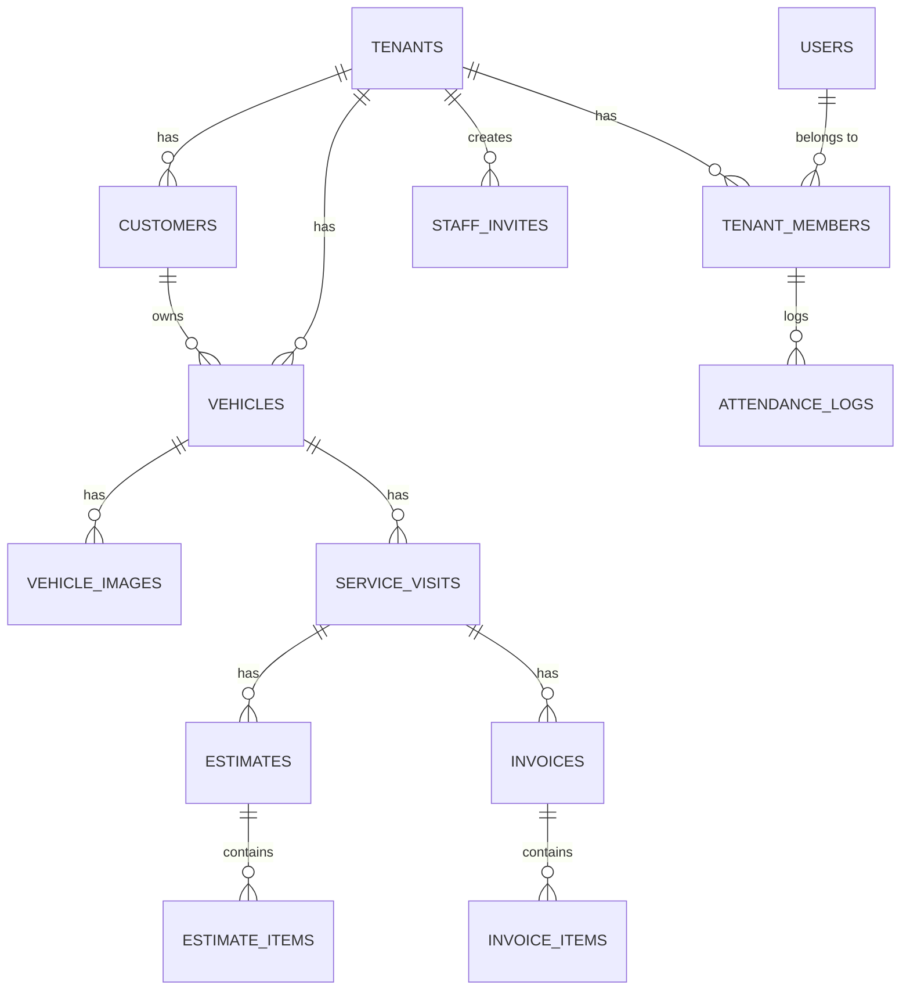

# Autro — Database Schema

> **Database:** Cloudflare D1 (SQLite)  
> **ORM:** Drizzle ORM  
> **IDs:** UUIDs everywhere  
> **Soft deletes:** `deleted_at` column on deletable tables  
> **Multi-tenant:** `tenant_id` on every tenant-scoped table  
> **Future-proof:** Schema supports multiple garages per user, but MVP UI only shows 1

---

## Entity Relationship Diagram



---

## All Tables

### 1. `users`

Global user table — not tenant-scoped.

| Column       | Type | Constraints      | Notes                  |
| ------------ | ---- | ---------------- | ---------------------- |
| `id`         | TEXT | PK               | UUID                   |
| `google_id`  | TEXT | UNIQUE, NOT NULL | Google OAuth `sub`     |
| `email`      | TEXT | UNIQUE, NOT NULL |                        |
| `name`       | TEXT | NOT NULL         |                        |
| `avatar_url` | TEXT |                  | Google profile picture |
| `created_at` | TEXT | NOT NULL         | ISO 8601               |
| `updated_at` | TEXT | NOT NULL         | ISO 8601               |

---

### 2. `tenants`

Each tenant = one garage/autro.

| Column              | Type    | Constraints             | Notes                    |
| ------------------- | ------- | ----------------------- | ------------------------ |
| `id`                | TEXT    | PK                      | UUID                     |
| `name`              | TEXT    | NOT NULL                | Garage name              |
| `owner_id`          | TEXT    | FK → users.id, NOT NULL |                          |
| `phone`             | TEXT    | NOT NULL                |                          |
| `address`           | TEXT    |                         |                          |
| `logo_url`          | TEXT    |                         | R2 path                  |
| `latitude`          | REAL    |                         | Autro GPS for attendance |
| `longitude`         | REAL    |                         | Autro GPS for attendance |
| `gps_radius_meters` | INTEGER | DEFAULT 100             | Allowed check-in radius  |
| `created_at`        | TEXT    | NOT NULL                |                          |
| `updated_at`        | TEXT    | NOT NULL                |                          |
| `deleted_at`        | TEXT    |                         | Soft delete              |

---

### 3. `tenant_members`

Junction table — links users to tenants with roles.

| Column           | Type | Constraints               | Notes              |
| ---------------- | ---- | ------------------------- | ------------------ |
| `id`             | TEXT | PK                        | UUID               |
| `tenant_id`      | TEXT | FK → tenants.id, NOT NULL |                    |
| `user_id`        | TEXT | FK → users.id, NOT NULL   |                    |
| `role`           | TEXT | NOT NULL                  | `OWNER` or `STAFF` |
| `monthly_salary` | REAL |                           | For staff only     |
| `joined_at`      | TEXT | NOT NULL                  |                    |
| `removed_at`     | TEXT |                           | Soft delete        |

UNIQUE(tenant_id, user_id) — a user can't be in the same garage twice.

---

### 4. `staff_invites`

Invitation links for staff to join a garage.

| Column           | Type | Constraints                 | Notes                             |
| ---------------- | ---- | --------------------------- | --------------------------------- |
| `id`             | TEXT | PK                          | UUID                              |
| `tenant_id`      | TEXT | FK → tenants.id, NOT NULL   |                                   |
| `invited_by`     | TEXT | FK → users.id, NOT NULL     |                                   |
| `token`          | TEXT | UNIQUE, NOT NULL            | Random invite token (used in URL) |
| `name`           | TEXT |                             | Pre-filled staff name             |
| `role`           | TEXT | NOT NULL, DEFAULT 'STAFF'   |                                   |
| `monthly_salary` | REAL |                             |                                   |
| `status`         | TEXT | NOT NULL, DEFAULT 'PENDING' | `PENDING`, `ACCEPTED`, `REVOKED`  |
| `created_at`     | TEXT | NOT NULL                    |                                   |

Note: No expiry — invite stays valid until owner revokes it.

---

### 5. `customers`

| Column       | Type | Constraints               | Notes       |
| ------------ | ---- | ------------------------- | ----------- |
| `id`         | TEXT | PK                        | UUID        |
| `tenant_id`  | TEXT | FK → tenants.id, NOT NULL |             |
| `name`       | TEXT | NOT NULL                  |             |
| `phone`      | TEXT | NOT NULL                  |             |
| `created_at` | TEXT | NOT NULL                  |             |
| `updated_at` | TEXT | NOT NULL                  |             |
| `deleted_at` | TEXT |                           | Soft delete |

UNIQUE(tenant_id, phone) — one customer per phone per garage.

---

### 6. `vehicles`

| Column                | Type | Constraints                 | Notes                                     |
| --------------------- | ---- | --------------------------- | ----------------------------------------- |
| `id`                  | TEXT | PK                          | UUID                                      |
| `tenant_id`           | TEXT | FK → tenants.id, NOT NULL   |                                           |
| `customer_id`         | TEXT | FK → customers.id, NOT NULL |                                           |
| `registration_number` | TEXT | NOT NULL                    | License plate                             |
| `name`                | TEXT |                             | Free text: "Honda City", "Splendor", etc. |
| `created_at`          | TEXT | NOT NULL                    |                                           |
| `updated_at`          | TEXT | NOT NULL                    |                                           |
| `deleted_at`          | TEXT |                             | Soft delete                               |

UNIQUE(tenant_id, registration_number) — one vehicle per plate per garage.

---

### 7. `vehicle_images`

| Column        | Type | Constraints                | Notes   |
| ------------- | ---- | -------------------------- | ------- |
| `id`          | TEXT | PK                         | UUID    |
| `tenant_id`   | TEXT | FK → tenants.id, NOT NULL  |         |
| `vehicle_id`  | TEXT | FK → vehicles.id, NOT NULL |         |
| `image_url`   | TEXT | NOT NULL                   | R2 path |
| `uploaded_at` | TEXT | NOT NULL                   |         |

---

### 8. `service_visits`

Each time a vehicle comes to the autro = 1 visit.

| Column         | Type | Constraints                | Notes                                    |
| -------------- | ---- | -------------------------- | ---------------------------------------- |
| `id`           | TEXT | PK                         | UUID                                     |
| `tenant_id`    | TEXT | FK → tenants.id, NOT NULL  |                                          |
| `vehicle_id`   | TEXT | FK → vehicles.id, NOT NULL |                                          |
| `complaint`    | TEXT |                            | What the customer reported               |
| `status`       | TEXT | NOT NULL, DEFAULT 'NEW'    | `NEW`, `REPAIRING`, `READY`, `DELIVERED` |
| `created_at`   | TEXT | NOT NULL                   |                                          |
| `updated_at`   | TEXT | NOT NULL                   |                                          |
| `delivered_at` | TEXT |                            | When marked delivered                    |
| `deleted_at`   | TEXT |                            | Soft delete                              |

---

### 9. `estimates`

| Column           | Type    | Constraints                      | Notes                        |
| ---------------- | ------- | -------------------------------- | ---------------------------- |
| `id`             | TEXT    | PK                               | UUID                         |
| `tenant_id`      | TEXT    | FK → tenants.id, NOT NULL        |                              |
| `visit_id`       | TEXT    | FK → service_visits.id, NOT NULL |                              |
| `discount_type`  | TEXT    |                                  | `FLAT` or `PERCENT`          |
| `discount_value` | REAL    | DEFAULT 0                        |                              |
| `tax_enabled`    | INTEGER | DEFAULT 0                        | 0 = no tax, 1 = tax on       |
| `tax_percent`    | REAL    | DEFAULT 0                        | e.g. 18 for GST              |
| `notes`          | TEXT    |                                  |                              |
| `status`         | TEXT    | NOT NULL, DEFAULT 'DRAFT'        | `DRAFT`, `SENT`, `CONVERTED` |
| `created_at`     | TEXT    | NOT NULL                         |                              |
| `updated_at`     | TEXT    | NOT NULL                         |                              |

---

### 10. `estimate_items`

Simple: just name + amount. No types.

| Column        | Type    | Constraints                 | Notes                            |
| ------------- | ------- | --------------------------- | -------------------------------- |
| `id`          | TEXT    | PK                          | UUID                             |
| `estimate_id` | TEXT    | FK → estimates.id, NOT NULL |                                  |
| `description` | TEXT    | NOT NULL                    | "Oil Change", "Brake Pads", etc. |
| `amount`      | REAL    | NOT NULL                    |                                  |
| `quantity`    | INTEGER | NOT NULL, DEFAULT 1         |                                  |
| `sort_order`  | INTEGER | NOT NULL, DEFAULT 0         | For display ordering             |

---

### 11. `invoices`

| Column           | Type    | Constraints                      | Notes                                       |
| ---------------- | ------- | -------------------------------- | ------------------------------------------- |
| `id`             | TEXT    | PK                               | UUID                                        |
| `tenant_id`      | TEXT    | FK → tenants.id, NOT NULL        |                                             |
| `visit_id`       | TEXT    | FK → service_visits.id, NOT NULL |                                             |
| `estimate_id`    | TEXT    | FK → estimates.id                | Nullable — set if imported from estimate    |
| `discount_type`  | TEXT    |                                  | `FLAT` or `PERCENT`                         |
| `discount_value` | REAL    | DEFAULT 0                        |                                             |
| `tax_enabled`    | INTEGER | DEFAULT 0                        |                                             |
| `tax_percent`    | REAL    | DEFAULT 0                        |                                             |
| `frozen_total`   | REAL    | NOT NULL                         | Locked at finalization — never recalculated |
| `payment_method` | TEXT    |                                  | `CASH`, `UPI`, `CARD`, `OTHER`              |
| `payment_status` | TEXT    | NOT NULL, DEFAULT 'UNPAID'       | `UNPAID`, `PAID`                            |
| `notes`          | TEXT    |                                  |                                             |
| `created_at`     | TEXT    | NOT NULL                         |                                             |
| `updated_at`     | TEXT    | NOT NULL                         |                                             |
| `paid_at`        | TEXT    |                                  | When marked paid                            |

---

### 12. `invoice_items`

Copied from estimate items (if imported). Independent — editing estimate doesn't change invoice.

| Column        | Type    | Constraints                | Notes |
| ------------- | ------- | -------------------------- | ----- |
| `id`          | TEXT    | PK                         | UUID  |
| `invoice_id`  | TEXT    | FK → invoices.id, NOT NULL |       |
| `description` | TEXT    | NOT NULL                   |       |
| `amount`      | REAL    | NOT NULL                   |       |
| `quantity`    | INTEGER | NOT NULL, DEFAULT 1        |       |
| `sort_order`  | INTEGER | NOT NULL, DEFAULT 0        |       |

---

### 13. `qr_codes`

Static QR code per garage. One active QR at a time.

| Column       | Type | Constraints                       | Notes                       |
| ------------ | ---- | --------------------------------- | --------------------------- |
| `id`         | TEXT | PK                                | UUID                        |
| `tenant_id`  | TEXT | FK → tenants.id, UNIQUE, NOT NULL | One QR per garage           |
| `token`      | TEXT | UNIQUE, NOT NULL                  | The value encoded in the QR |
| `created_at` | TEXT | NOT NULL                          |                             |

Note: Owner can regenerate (replaces old token). Static = no timer, no auto-refresh.
GPS is the anti-cheat, not QR rotation.

---

### 14. `attendance_logs`

| Column          | Type | Constraints                      | Notes               |
| --------------- | ---- | -------------------------------- | ------------------- |
| `id`            | TEXT | PK                               | UUID                |
| `tenant_id`     | TEXT | FK → tenants.id, NOT NULL        |                     |
| `member_id`     | TEXT | FK → tenant_members.id, NOT NULL |                     |
| `date`          | TEXT | NOT NULL                         | YYYY-MM-DD          |
| `check_in_at`   | TEXT |                                  | ISO 8601            |
| `check_out_at`  | TEXT |                                  | ISO 8601            |
| `check_in_lat`  | REAL |                                  | GPS at check-in     |
| `check_in_lng`  | REAL |                                  | GPS at check-in     |
| `check_out_lat` | REAL |                                  | GPS at check-out    |
| `check_out_lng` | REAL |                                  | GPS at check-out    |
| `status`        | TEXT | NOT NULL, DEFAULT 'PRESENT'      | `PRESENT`, `ABSENT` |

UNIQUE(tenant_id, member_id, date) — one attendance record per staff per day.

---

## Indexes

```sql
-- Service visits for a vehicle
CREATE INDEX idx_visits_vehicle ON service_visits(tenant_id, vehicle_id);

-- Service visits by status (for dashboard stats + filtering)
CREATE INDEX idx_visits_status ON service_visits(tenant_id, status);

-- Attendance by member + date
CREATE INDEX idx_attendance_date ON attendance_logs(tenant_id, member_id, date);

-- User's tenant memberships (for login → find garages)
CREATE INDEX idx_members_user ON tenant_members(user_id);

-- Invoice payment status (for unpaid invoices dashboard card)
CREATE INDEX idx_invoices_payment ON invoices(tenant_id, payment_status);
```

---

## Design Decisions

| Decision                                    | Why                                                                                                                                          |
| ------------------------------------------- | -------------------------------------------------------------------------------------------------------------------------------------------- |
| **`registration_number` unique per tenant** | One vehicle, many visits. Search plate → found? Add new visit. Not found? Create vehicle + customer + visit.                                 |
| **`service_visits` as central entity**      | Each garage visit is separate. A vehicle can have 50 visits over years. Estimates and invoices link to visits, not directly to vehicles.     |
| **`frozen_total` on invoices**              | Invoice total is locked. Even if someone edits items later (they shouldn't), the financial record is preserved.                              |
| **Estimate items COPIED to invoice**        | When converting estimate → invoice, items are duplicated (not referenced). Estimate stays as historical record.                              |
| **Soft deletes**                            | `deleted_at` column. Filter with `WHERE deleted_at IS NULL`. Never permanently lose data.                                                    |
| **`tenant_id` on every table**              | Multi-tenant isolation. Every query must filter by tenant_id.                                                                                |
| **UUIDs for IDs**                           | No sequential IDs exposed in URLs. Safe, non-guessable.                                                                                      |
| **No `vehicle_type` enum**                  | Just a free-text `name` field. Owner types "Honda City" or "Splendor" — simple.                                                              |
| **Estimate items: no types**                | Just `description` + `amount`. No Labor/Parts/Extra categories. Simple.                                                                      |
| **Static QR (not rotating)**                | GPS is the anti-cheat, not QR rotation. Simpler, no timer logic. Owner can regenerate manually if compromised.                               |
| **Invite links never expire**               | Small garage, trust-based. Owner can revoke if needed. Less friction.                                                                        |
| **DB supports multi-garage**                | `tenant_members` junction table supports a user being in multiple garages. MVP UI just shows 1. Easy to unlock later without schema changes. |
