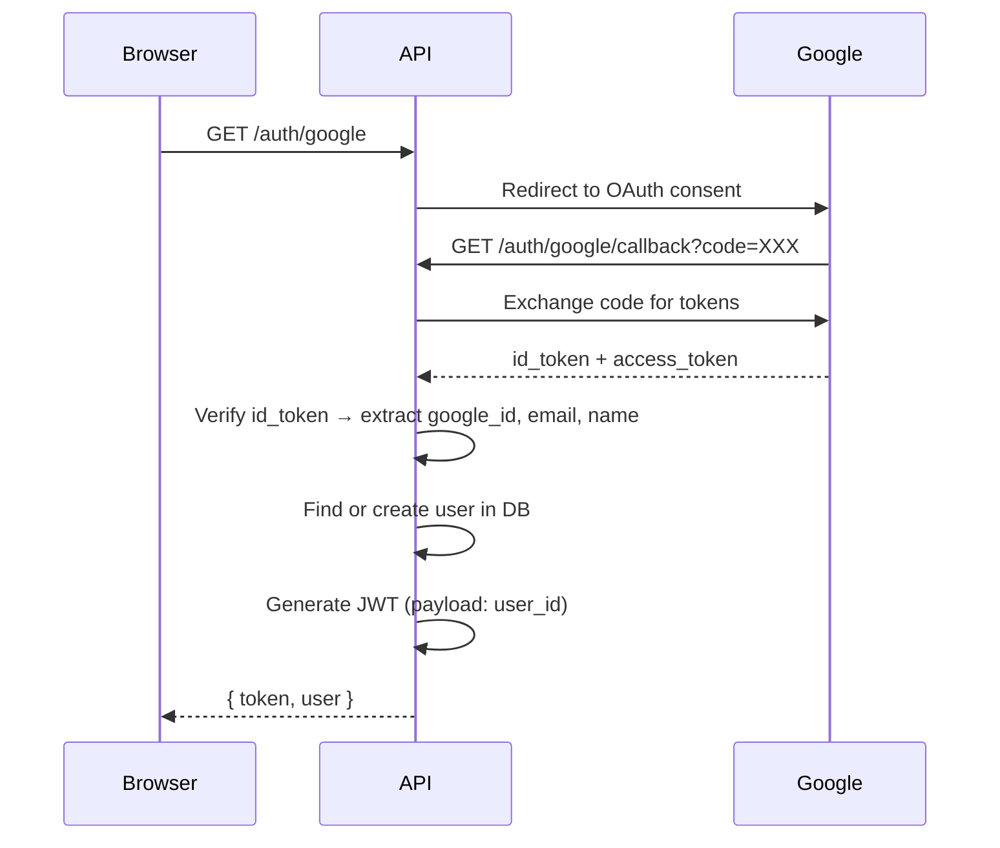
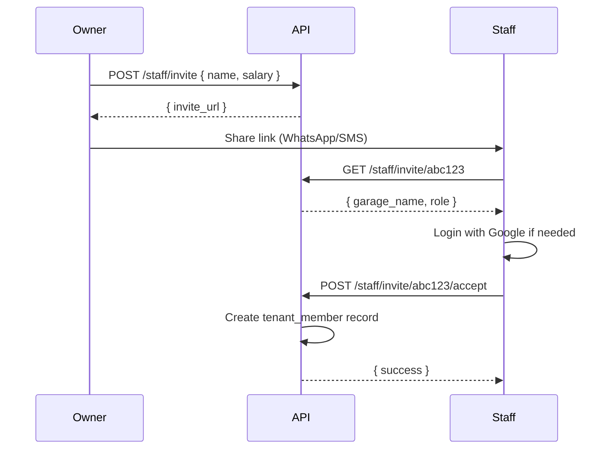

# Workshop — API Routes

> **Framework:** Hono  
> **Base URL:** `https://api.workshop.zeonweb.com` (or `workshop.zeonweb.com/api`)  
> **Auth:** JWT in Authorization header (Bearer token)  
> **Tenant:** `X-Tenant-ID` header on all tenant-scoped routes

---

## Auth Routes (Public)

| Method | Route                   | Description                                           |
| ------ | ----------------------- | ----------------------------------------------------- |
| `GET`  | `/auth/google`          | Redirect to Google OAuth consent screen               |
| `GET`  | `/auth/google/callback` | Handle OAuth callback → create/find user → return JWT |
| `POST` | `/auth/refresh`         | Refresh expired JWT                                   |

### Auth Flow



---

## Tenant Routes

| Method  | Route           | Auth        | Description                                            |
| ------- | --------------- | ----------- | ------------------------------------------------------ |
| `POST`  | `/tenants`      | JWT         | Create new garage (onboarding)                         |
| `GET`   | `/tenants/mine` | JWT         | Get the user's garage (redirect to onboarding if none) |
| `PATCH` | `/tenants/:id`  | JWT + Owner | Update garage details (settings page)                  |

### POST `/tenants` Request Body

```json
{
  "name": "Azim Auto Workshop",
  "phone": "9876543210",
  "address": "123, Main Road, Bhubaneswar",
  "logo_url": "r2://logos/abc123.webp",
  "latitude": 20.2961,
  "longitude": 85.8245
}
```

### PATCH `/tenants/:id` Request Body

All fields optional — only send what changed:

````json
{
  "name": "Azim Auto Workshop",
  "phone": "9876543210",
  "address": "456, New Road",
  "logo_url": "r2://logos/new-logo.webp",
  "latitude": 20.2961,
  "longitude": 85.8245,
  "gps_radius_meters": 150
}

---

## Vehicle Routes

All require JWT + X-Tenant-ID.

| Method | Route | Description |
|---|---|---|
| `GET` | `/vehicles?status=X&cursor=X` | List vehicles (paginated, filterable by status) |
| `GET` | `/vehicles/search?plate=XX` | Search by registration number (autocomplete) |
| `POST` | `/vehicles` | Create vehicle + customer + first service visit |
| `GET` | `/vehicles/:id` | Get vehicle with customer, images, latest visit |
| `PATCH` | `/vehicles/:id` | Update vehicle details |
| `POST` | `/vehicles/:id/visits` | Create new service visit for returning vehicle |
| `POST` | `/vehicles/:id/images` | Add photo to existing vehicle |

### POST `/vehicles` — What it does

This single endpoint handles the full "add vehicle" flow:

1. Finds or creates the customer (by phone number)
2. Finds or creates the vehicle (by registration_number)
3. Creates a new service_visit
4. Links uploaded images

```json
{
  "registration_number": "OD 02 AB 1234",
  "name": "Honda City",
  "customer_name": "Azim",
  "customer_phone": "9876543210",
  "complaint": "Engine noise",
  "image_urls": ["r2://path/to/image1.webp"]
}
````

### PATCH `/vehicles/:id` Request Body

All fields optional:

```json
{
  "registration_number": "OD 02 AB 1234",
  "name": "Honda City 2024"
}
```

### POST `/vehicles/:id/visits` Request Body

Creates a new service visit for a vehicle that already exists (returning customer):

```json
{
  "complaint": "AC not cooling",
  "image_urls": ["r2://path/to/image.webp"]
}
```

### POST `/vehicles/:id/images` Request Body

```json
{
  "image_url": "r2://path/to/image.webp"
}
```

---

## Service Visit Routes

| Method  | Route                  | Description                                         |
| ------- | ---------------------- | --------------------------------------------------- |
| `GET`   | `/visits?vehicle_id=X` | List visits for a vehicle                           |
| `PATCH` | `/visits/:id/status`   | Update status (NEW → REPAIRING → READY → DELIVERED) |

---

## Estimate Routes

| Method   | Route                          | Description                                          |
| -------- | ------------------------------ | ---------------------------------------------------- |
| `GET`    | `/estimates?visit_id=X`        | Get estimate for a visit                             |
| `GET`    | `/estimates?status=X&cursor=X` | List all estimates (paginated, filterable by status) |
| `GET`    | `/estimates/:id`               | Get single estimate with items                       |
| `POST`   | `/estimates`                   | Create estimate with items                           |
| `PATCH`  | `/estimates/:id`               | Update estimate (discount, tax, notes)               |
| `POST`   | `/estimates/:id/items`         | Add an item                                          |
| `PATCH`  | `/estimates/:id/items/:itemId` | Update an item                                       |
| `DELETE` | `/estimates/:id/items/:itemId` | Remove an item                                       |

### POST `/estimates` Request Body

```json
{
  "visit_id": "uuid",
  "items": [
    { "description": "Oil Change", "amount": 500, "quantity": 1 },
    { "description": "Brake Pads", "amount": 2400, "quantity": 1 }
  ],
  "discount_type": null,
  "discount_value": 0,
  "tax_enabled": false,
  "tax_percent": 0,
  "notes": ""
}
```

---

## Invoice Routes

| Method  | Route                                 | Description                                     |
| ------- | ------------------------------------- | ----------------------------------------------- |
| `GET`   | `/invoices?status=X&cursor=X`         | List invoices (paginated, filterable)           |
| `GET`   | `/invoices/:id`                       | Get invoice with items                          |
| `POST`  | `/invoices`                           | Create invoice (fresh)                          |
| `POST`  | `/invoices/from-estimate/:estimateId` | Create invoice by importing estimate            |
| `PATCH` | `/invoices/:id`                       | Update invoice items/details                    |
| `PATCH` | `/invoices/:id/pay`                   | Mark as paid (set payment_method, freeze total) |

### POST `/invoices` Request Body (Fresh Invoice)

```json
{
  "visit_id": "uuid",
  "items": [
    { "description": "Engine Repair", "amount": 3500, "quantity": 1 },
    { "description": "Oil Change", "amount": 500, "quantity": 1 }
  ],
  "discount_type": "FLAT",
  "discount_value": 200,
  "tax_enabled": true,
  "tax_percent": 18,
  "notes": ""
}
```

### PATCH `/invoices/:id` Request Body

All fields optional — only send what changed:

```json
{
  "discount_type": "PERCENT",
  "discount_value": 10,
  "tax_enabled": true,
  "tax_percent": 18,
  "notes": "Updated after discussion"
}
```

### PATCH `/invoices/:id/pay` Request Body

```json
{
  "payment_method": "UPI"
}
```

This freezes `frozen_total`, sets `payment_status` to `PAID`, and records `paid_at`.

### POST `/invoices/from-estimate/:estimateId` — What it does

1. Fetches the estimate + all its items
2. Creates a new invoice linked to the same visit
3. **COPIES** all estimate items into invoice_items
4. Sets `invoice.estimate_id` for reference
5. Marks estimate status as `CONVERTED`
6. Returns the new invoice

The owner can then edit the invoice items before finalizing.

---

## Staff Routes

| Method   | Route                         | Description                                     |
| -------- | ----------------------------- | ----------------------------------------------- |
| `GET`    | `/staff`                      | List all staff (with today's attendance status) |
| `POST`   | `/staff/invite`               | Create invite link                              |
| `GET`    | `/staff/invite/:token`        | Get invite details (public — no auth)           |
| `POST`   | `/staff/invite/:token/accept` | Accept invite (requires JWT)                    |
| `GET`    | `/staff/:id`                  | Staff profile + attendance summary              |
| `PATCH`  | `/staff/:id`                  | Update staff salary                             |
| `DELETE` | `/staff/:id`                  | Soft-remove staff                               |
| `PATCH`  | `/staff/invite/:id/revoke`    | Revoke a pending invite                         |

### Staff Invitation Flow



---

## Attendance Routes

| Method | Route                                           | Description                        |
| ------ | ----------------------------------------------- | ---------------------------------- |
| `GET`  | `/attendance/qr`                                | Get current QR token (owner)       |
| `POST` | `/attendance/qr/regenerate`                     | Generate new QR token (owner)      |
| `POST` | `/attendance/checkin`                           | Staff check-in (QR token + GPS)    |
| `POST` | `/attendance/checkout`                          | Staff check-out (GPS)              |
| `GET`  | `/attendance/today`                             | Today's attendance summary (owner) |
| `GET`  | `/attendance/my-today`                          | Staff's own attendance for today   |
| `GET`  | `/attendance/monthly?member_id=X&month=YYYY-MM` | Monthly report                     |

### POST `/attendance/checkin` Request Body

```json
{
  "qr_token": "abc123xyz",
  "latitude": 20.2961,
  "longitude": 85.8245
}
```

### POST `/attendance/checkout` Request Body

```json
{
  "latitude": 20.2961,
  "longitude": 85.8245
}
```

### Check-in Verification Logic

```
1. Staff sends: { qr_token, latitude, longitude }
2. API verifies qr_token matches garage's active QR
3. API calculates distance between staff GPS and garage GPS
4. If distance <= garage.gps_radius_meters → CHECK-IN SUCCESS
5. If distance > radius → REJECTED ("You are not at the workshop")
6. Create attendance_log with check_in_at + GPS coords
```

---

## Upload Routes

| Method | Route             | Description                 |
| ------ | ----------------- | --------------------------- |
| `POST` | `/upload/presign` | Get R2 presigned upload URL |

### Upload Flow

```
1. Frontend compresses image to WebP (client-side)
2. Frontend calls POST /upload/presign { filename, content_type }
3. API returns { upload_url, file_key }
4. Frontend does PUT to upload_url with the WebP blob
5. Frontend saves file_key as image_url in vehicle_images
```

---

## Dashboard Routes

| Method | Route              | Description             |
| ------ | ------------------ | ----------------------- |
| `GET`  | `/dashboard/stats` | Today's dashboard stats |

### Response

```json
{
  "vehicles_today": 5,
  "repairing": 3,
  "ready": 1,
  "revenue_today": 12500,
  "unpaid_invoices": 2
}
```

---

## Error Response Format

All errors follow the same shape:

```json
{
  "error": {
    "code": "VALIDATION_ERROR",
    "message": "Registration number is required"
  }
}
```

HTTP status codes:

- `400` — Validation error
- `401` — Not authenticated
- `403` — Not authorized (wrong tenant/role)
- `404` — Not found
- `409` — Conflict (duplicate)
- `500` — Server error
