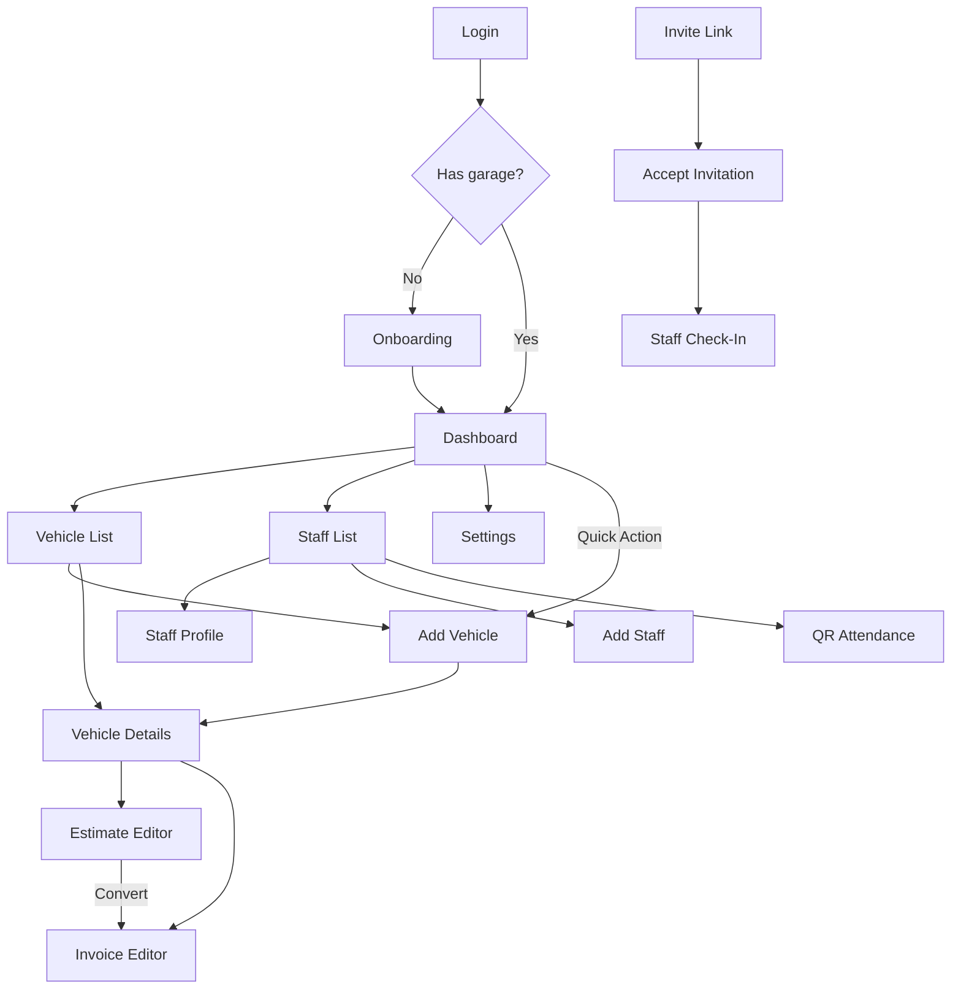

# Workshop — UI Screens & Design System

---

## Design System

### Color Palette

| Token            | Hex                     | Usage                              |
| ---------------- | ----------------------- | ---------------------------------- |
| `primary`        | `#2563eb` (Blue 600)    | CTAs, active states, totals, links |
| `primary-hover`  | `#1d4ed8` (Blue 700)    | Hover/pressed                      |
| `primary-light`  | `#dbeafe` (Blue 100)    | Subtle backgrounds                 |
| `bg`             | `#f1f5f9` (Slate 100)   | Page background                    |
| `card`           | `#ffffff`               | Cards, inputs, nav                 |
| `border`         | `#cbd5e1` (Slate 300)   | Input borders                      |
| `divider`        | `#e2e8f0` (Slate 200)   | Divider lines                      |
| `text`           | `#0f172a` (Slate 900)   | Primary text                       |
| `text-secondary` | `#64748b` (Slate 500)   | Labels, captions                   |
| `success`        | `#10b981` (Emerald 500) | Paid, present, done                |
| `success-light`  | `#d1fae5` (Emerald 100) | Success badge bg                   |
| `warning`        | `#f59e0b` (Amber 500)   | Pending, active                    |
| `warning-light`  | `#fef3c7` (Amber 100)   | Warning badge bg                   |
| `danger`         | `#ef4444` (Red 500)     | Absent, error                      |
| `danger-light`   | `#fee2e2` (Red 100)     | Danger badge bg                    |

### Typography

- **Font:** `'Inter', sans-serif` (Google Fonts)

| Element                | Size           | Weight                                  |
| ---------------------- | -------------- | --------------------------------------- |
| Hero stat / Total      | 2rem (32px)    | 700 Bold                                |
| Page title (topbar)    | 1.2rem (19px)  | 600 Semi-bold                           |
| Card title / List name | 1.1rem (18px)  | 700 Bold                                |
| Body / Inputs          | 1rem (16px)    | 400 Regular                             |
| Section header         | 0.95rem        | 700 Bold, UPPERCASE, 1px letter-spacing |
| Badge / Nav label      | 0.75rem (12px) | 700 Bold                                |

#### Implementation tokens (added 2026-08-13)

⚠️ **This table was already correct — the first build ignored it** and used
Tailwind's default scale (`text-sm`, `text-xs`), which rendered every screen
20–38% smaller and lighter than intended. That was the main reason production
looked worse than `planning/demo-ui`. To stop it drifting again, each row above now
has a named token in `apps/web/src/index.css`; use the token, not a raw
Tailwind size:

| Spec row | Token | Tailwind class |
| -------- | ----- | -------------- |
| Hero stat / Total | `--text-value-xl` | `text-value-xl` |
| Stat tile value / greeting | `--text-value` | `text-value` |
| Card title / List name | `--text-row-title` | `text-row-title` |
| Detail row | `--text-detail` | `text-detail` |
| Section header / form label | `--text-label` | `text-label` |
| Row subtitle / tile label | `--text-row-sub` | `text-row-sub` |

Also: do **not** set `-webkit-font-smoothing: antialiased`. It thins every glyph.
The demo never set it and reads sturdier without it.

### Spacing & Radius

| Element                    | Value                         |
| -------------------------- | ----------------------------- |
| Card radius                | `16px` (rounded-2xl)          |
| Button radius              | `16px` (rounded-2xl)          |
| Input radius               | `12px` (rounded-xl)           |
| Page padding               | `16px`                        |
| Bottom padding             | `100px` (to clear bottom nav) |
| Content max-width          | see Responsive Layout below   |

### Responsive Layout (amended 2026-08-13 — supersedes the 414px cap)

The original spec fixed the app at `max-width: 414px` on all screens. Owner
approved full responsive support on 2026-08-13; that cap is removed.

| Breakpoint | Width | Nav | Content | Modal |
| ---------- | ----- | --- | ------- | ----- |
| base | `< 640px` | Fixed bottom nav, 4 tabs, icon + label | Single column, full-bleed cards, `16px` page padding | Bottom sheet |
| `md:` | `≥ 768px` | Left sidebar, icon + label always visible | 2-column grid, content `max-w-3xl` | Centered dialog |
| `lg:` | `≥ 1024px` | Left sidebar | Sidebar + content + optional detail pane. **Lists become tables** (reg no. / vehicle / customer / status / amount) instead of stacked cards | Centered dialog |

Rules:

- Minimum supported width is **360px** (small Android). No horizontal scroll.
- Bottom nav must use `env(safe-area-inset-bottom)` for notched phones.
- The mobile bottom-sheet modal and the desktop centered dialog are the **same
  component** at different breakpoints, not two components.
- Verify each screen at 360 / 414 / 768 / 1024 / 1440.

### Shadows

| Element        | Shadow                                  |
| -------------- | --------------------------------------- |
| Card           | `0 4px 6px -1px rgba(0,0,0,0.05)`       |
| Topbar         | `0 2px 10px rgba(0,0,0,0.05)`           |
| Primary button | `0 10px 15px -3px rgba(37,99,235,0.3)`  |
| Success button | `0 10px 15px -3px rgba(16,185,129,0.3)` |

### Button Variants

| Variant   | Style                               | Use                          |
| --------- | ----------------------------------- | ---------------------------- |
| `primary` | Blue bg, white text, blue glow      | Main CTAs                    |
| `outline` | Transparent, blue border, blue text | Secondary actions            |
| `dashed`  | Transparent, dashed blue border     | Add items                    |
| `success` | Green bg, white text, green glow    | Positive actions (Mark Paid) |
| `ghost`   | No bg, no border, blue text         | Links, cancel                |

### Micro-Animations

| Element              | Effect                             |
| -------------------- | ---------------------------------- |
| Button press         | `active:scale-[0.98]`              |
| Card hover (desktop) | `translate-y-[-2px]`               |
| Page enter           | Fade in + slide up 8px over 200ms  |
| Toast                | Slide in from top, auto-dismiss 3s |

---

## Reusable Components

### Layout Components

| Component           | Description                                                              |
| ------------------- | ------------------------------------------------------------------------ |
| `<MobileContainer>` | Responsive app shell. Full-width on phones; constrained + centered with slate outer bg at `md:`+. (Name is historical — it is no longer mobile-only. See Responsive Layout above.) |
| `<PageShell>`       | Wraps topbar + scrollable content area + nav (bottom nav on mobile, sidebar at `md:`+) |
| `<Topbar>`          | Sticky top bar: back button (or menu), title, optional right action icon |
| `<BottomNav>`       | 4-tab navigation: Home, Vehicles, Staff, Settings. Fixed bottom on mobile, left sidebar at `md:`+ |

### UI Components

| Component       | Description                                                                |
| --------------- | -------------------------------------------------------------------------- |
| `<Button>`      | Variants: primary, outline, dashed, success, ghost. Full-width by default. |
| `<Card>`        | White rounded-2xl container with soft shadow                               |
| `<Badge>`       | Status pill: success (green), danger (red), warning (amber)                |
| `<Input>`       | Label + input with rounded-xl, slate border, blue focus ring               |
| `<Textarea>`    | Same as Input but multiline                                                |
| `<Select>`      | Styled dropdown                                                            |
| `<SearchBar>`   | Input with magnifying glass icon                                           |
| `<PhotoUpload>` | Dashed border box with camera icon, tap to capture/upload                  |
| `<StatCard>`    | Metric card: icon + number + label                                         |
| `<ListItem>`    | Clickable row card: icon/avatar + title + subtitle + right content         |
| `<PriceRow>`    | Item name + ₹ price on a single row                                        |
| `<TotalRow>`    | Bold divider + large total amount                                          |
| `<EmptyState>`  | Illustration + message when list is empty                                  |
| `<Loading>`     | Skeleton shimmer or spinner                                                |
| `<Modal>`       | Bottom sheet modal (mobile-friendly)                                       |
| `<Toast>`       | Success/error notification slide-in from top                               |
| `<FilterChips>` | Horizontal scrollable chip buttons for filtering                           |

### Domain Components

| Component         | Description                                                                                   |
| ----------------- | --------------------------------------------------------------------------------------------- |
| `<VehicleSearch>` | Type registration number → autocomplete → tap to auto-fill all fields                         |
| `<ContactPicker>` | Tap icon → device contacts → select → auto-fill name + phone. Hidden on unsupported browsers. |
| `<QRDisplay>`     | Shows the garage's static QR code. "Staff scan this to check in"                              |
| `<QRScanner>`     | Camera-based QR scanner. Reads token, captures GPS, sends to API.                             |
| `<EstimateItems>` | Add/remove/reorder estimate line items                                                        |
| `<InvoiceItems>`  | Same pattern for invoice items                                                                |

---

## All Screens

### Screen 1: Login

**Route:** `/login` — **Access:** Public

- Centered layout, clean
- App name "Workshop" + subtitle "Garage Management Made Simple"
- Single "Sign in with Google" button
- Nothing else — dead simple

---

### Screen 2: Onboarding

**Route:** `/onboarding` — **Access:** Authenticated, no garage yet

- Single scrollable form
- Fields:
  - Garage Name (required)
  - Phone Number (required)
  - Address (optional)
  - Logo Upload (optional)
  - "Set Workshop Location" button → captures GPS
- Small note: "We need these details for your invoices and staff attendance"
- Primary "Create Workshop" button

---

### Screen 3: Dashboard

**Route:** `/` — **Access:** Owner

- **Topbar:** Menu icon + "Workshop" + profile icon (→ settings)
- **Stats:**
  - Hero card: Vehicles Today (big number)
  - 2-column grid:
    - Repairing (amber)
    - Ready for Delivery (green)
    - Today's Revenue ₹ (blue)
    - Unpaid Invoices (red)
- **Quick Actions** (uppercase section header):
  - New Vehicle → `/vehicles/add`
  - New Estimate → `/estimates`
  - Generate Invoice → `/invoices`
  - Staff → `/staff`
- **Bottom Nav:** Home (active) | Vehicles | Staff | Settings

---

### Screen 4: Vehicle List

**Route:** `/vehicles` — **Access:** Owner

- **Topbar:** Back + "Vehicles"
- **Filter chips:** `All` | `Repairing` | `Ready` | `Delivered`
- **Search bar**
- **Vehicle list cards:** Registration number + vehicle name + customer name + status badge
- Tap card → `/vehicles/:id`
- **Pagination:** "Load More" button (cursor-based)
- **Bottom Nav**

---

### Screen 5: Add Vehicle

**Route:** `/vehicles/add` — **Access:** Owner

- **Topbar:** Back + "New Vehicle"
- **Form (top to bottom):**
  1. Photo Upload (dashed box, camera icon)
  2. Registration Number — **with autocomplete dropdown**
     - As user types, search existing vehicles
     - Match found → show suggestion (plate + customer name)
     - Tap suggestion → auto-fill all fields
  3. Vehicle Name (free text: "Honda City")
  4. Customer Name + 📱 contact picker icon (shown only on supported browsers)
  5. Customer Phone
  6. Complaint (textarea)
- Primary "Save Vehicle" button
- On save → navigate to `/vehicles/:id`

---

### Screen 6: Vehicle Details

**Route:** `/vehicles/:id` — **Access:** Owner

- **Topbar:** Back + registration number
- **Photo gallery:** Horizontal scroll + "+ Add Photo"
- **Customer card:** Name, Phone, Vehicle Name
- **Complaint card:** Warning icon + complaint text
- **Status:** Current status + change buttons (Repairing → Ready → Delivered)
- **Financial summary (2-column):**
  - Estimate: ₹X (or "—")
  - Invoice: ₹X (or "—")
- **Action buttons (stacked):**
  - Create Estimate → `/estimates/new?visit=X`
  - Generate Invoice → `/invoices/new?visit=X`
- **Vehicle History:** Past service visits (paginated)

---

### Screen 7: Estimate Editor

**Route:** `/estimates/:id` or `/estimates/new?visit=X` — **Access:** Owner

- **Topbar:** Back + "Estimate"
- Customer/Vehicle summary card (read-only)
- **ITEMS section:**
  - List of items (description + ₹ amount per row)
  - Editable inline or tap to edit
  - Swipe/delete icon to remove
  - "+ Add Item" dashed button
- **Optional Tax toggle:**
  - "Add Tax" checkbox → shows Tax % input when on
  - Tax calculated automatically
- **Optional Discount:**
  - Switch between Flat (₹) and Percentage (%)
- **Total section:**
  - Subtotal
  - Tax (if enabled)
  - Discount (if any)
  - **Grand Total** (large, bold, blue)
- **Action buttons:**
  - Outline: "Save"
  - Primary: "Convert to Invoice"

---

### Screen 8: Invoice Editor

**Route:** `/invoices/:id` or `/invoices/new?visit=X` or `/invoices/new?from_estimate=X` — **Access:** Owner

- Same layout as Estimate Editor, plus:
  - If imported from estimate: items pre-filled, editable
  - Left blue accent border on customer card (visual distinction)
- **Action buttons:**
  - 2-column: "PDF" + "Print"
  - Full width: "Share on WhatsApp"
  - Full width success: "Mark as Paid"
- **On "Mark as Paid":**
  - Bottom sheet modal: select payment method (Cash | UPI | Card | Other)
  - Confirm → freezes total, sets paid_at

---

### Screen 9: Estimate List

**Route:** `/estimates` — **Access:** Owner

- **Topbar:** Back + "Estimates"
- List of estimates: vehicle plate + customer name + ₹ total + status badge (Draft/Sent/Converted)
- Tap → `/estimates/:id`
- Empty state if no estimates

---

### Screen 10: Invoice List

**Route:** `/invoices` — **Access:** Owner

- **Topbar:** Back + "Invoices"
- **Filter chips:** `All` | `Unpaid` | `Paid`
- Invoice cards: vehicle plate + customer name + ₹ total + payment badge (Paid green / Unpaid red)
- Tap → `/invoices/:id`

---

### Screen 11: Staff List

**Route:** `/staff` — **Access:** Owner

- **Topbar:** Back + "Staff" + QR icon (→ `/staff/attendance`)
- **Search bar**
- **Staff cards:** Icon + Name + Role + today's attendance badge (Present/Absent/Not yet)
- Tap → `/staff/:id`
- Primary "Add Staff" button → `/staff/add`

---

### Screen 12: Add Staff / Invite

**Route:** `/staff/add` — **Access:** Owner

- **Topbar:** Back + "Add Staff"
- **Form:**
  - Staff Name
  - Monthly Salary (₹)
- Primary "Generate Invite Link" button
- **After generation:**
  - Copyable link box
  - "Copy Link" button
  - "Share on WhatsApp" button

---

### Screen 13: Staff Profile

**Route:** `/staff/:id` — **Access:** Owner

- **Topbar:** Back + staff name
- **Profile header:** Icon + Name + Role
- **Today:** IN time (green) + OUT time (or "--:--")
- **This Month (2-column):** Present X days, Absent X days
- **Estimated Salary card:**
  - Formula: (present_days / total_working_days) × monthly_salary
  - Large blue ₹ amount
- **Actions:**
  - Outline: "View Full Attendance"
  - Primary: "Edit Salary"
  - Danger outline: "Remove Staff"

---

### Screen 14: QR Attendance (Owner)

**Route:** `/staff/attendance` — **Access:** Owner

- **Topbar:** Back + "Staff Attendance"
- **QR card:**
  - Large static QR code
  - "Staff can scan this QR to check in"
  - Note: "Works only when staff is at the workshop location"
- **Today's stats (2-column):** Present X, Absent X
- Outline "Regenerate QR" button
- **Today's attendance list:** each staff with check-in/out time + badge

---

### Screen 15: QR Check-In (Staff)

**Route:** `/checkin` — **Access:** Staff only

This is the MAIN screen staff sees after login. Staff has no other screens.

- Greeting: "Hi, [Name]" + garage name
- **If not checked in:**
  - Large "Check In" button → opens camera QR scanner
  - Scan QR → sends token + GPS to API
  - Success → "✅ Checked in at 9:08 AM"
  - Fail → "❌ You are not at the workshop"
- **If checked in:**
  - Show check-in time
  - "Check Out" button → captures GPS → sends to API
- **If checked in + checked out:**
  - Show both times
  - "Done for today" state
- **Bottom:** Monthly attendance summary (present/absent days)

---

### Screen 16: Accept Invitation

**Route:** `/invite/:token` — **Access:** Public (then auth)

- "You've been invited to join [Garage Name]"
- Role: Staff
- Invited by: [Owner Name]
- If not logged in: "Sign in with Google to accept"
- If logged in: "Accept Invitation" button
- On accept → redirect to `/checkin`

---

### Screen 17: Settings

**Route:** `/settings` — **Access:** Owner

- **Topbar:** "Settings"
- **Profile section:** Google avatar + Name + Email (read-only)
- **Garage section:**
  - Garage Name (editable)
  - Phone (editable)
  - Address (editable)
  - Logo (change)
  - "Update Location" button
- **Actions:**
  - "Save Changes" button
  - "Sign Out" (danger ghost)

---

## Navigation Map



---

## Key User Flows

### Flow 1: Adding a Vehicle (< 1 min)

```
Dashboard → Tap "New Vehicle" → Add Vehicle Page
→ (Optional) Take photo
→ Type registration number → autocomplete searches
  → If found: tap suggestion → all fields auto-fill
  → If not found: type manually
    → Tap contact picker → select from phone contacts → name + phone auto-fill
→ Enter vehicle name + complaint
→ Tap "Save Vehicle"
→ Vehicle Details page (ready for estimate/work)
```

### Flow 2: Estimate → Invoice (< 2 min)

```
Vehicle Details → Tap "Create Estimate"
→ Estimate Editor → Add items (description + ₹ amount)
→ (Optional) Toggle tax, set discount
→ Save estimate
→ Tap "Convert to Invoice"
→ Invoice Editor (items pre-filled from estimate)
→ Edit if needed → Save
→ Mark as Paid → Select payment method → Done
→ Generate PDF → Share on WhatsApp
```

### Flow 3: Staff Check-In (< 10 sec)

```
Staff opens app → Check-In page
→ Tap "Check In" → Camera opens
→ Scan QR code at workshop
→ GPS captured automatically
→ API verifies: QR token valid + GPS within radius
→ ✅ "Checked in at 9:08 AM"
```

### Flow 4: Staff Invitation

```
Owner → Staff page → "+ Add Staff"
→ Enter name + salary → "Generate Invite Link"
→ Copy link or share via WhatsApp
→ Staff clicks link → sees invitation details
→ Signs in with Google → taps "Accept"
→ Now a member → sees Check-In page
```

---

## Build Order (Phase by Phase)

### Phase 0: Project Setup (1-2 days)

- Initialize monorepo (npm workspaces)
- Setup Vite + React + TypeScript + Tailwind v4
- Setup Hono Worker project + Drizzle
- Setup shared package with Zod schemas
- Configure wrangler.toml + .env.example
- ESLint + Prettier

### Phase 1: Auth + Onboarding (2-3 days)

- Google OAuth flow (backend + frontend)
- JWT generation + auth middleware
- Login page
- Onboarding page + tenant creation API
- Auth provider + protected routes

### Phase 2: Design System + Layout (1-2 days)

- All UI components (Button, Card, Badge, Input, etc.)
- Layout components (MobileContainer, PageShell, Topbar, BottomNav)
- Design tokens in Tailwind config
- Loading + empty states + toast

### Phase 3: Vehicle Management (3-4 days)

- DB tables + API routes (vehicles, customers, visits)
- Dashboard page with stats
- Vehicle list (paginated, filterable with chips)
- Add vehicle form (registration search, contact picker, photo upload)
- Vehicle details page

### Phase 4: Estimates & Invoices (3-4 days)

- DB tables + API routes (estimates, invoices + items)
- Estimate editor (add/remove items, optional tax, discount)
- Invoice editor + estimate import
- PDF generation (client-side)
- WhatsApp sharing (wa.me)
- Mark as paid flow

### Phase 5: Staff Management (3-4 days)

- DB tables + API routes (staff, invites)
- Staff list + profile pages
- Add staff + invite link generation
- Invite acceptance page
- Salary calculation from attendance

### Phase 6: Attendance System (2-3 days)

- DB tables + API routes (QR, attendance)
- QR display page (owner, static)
- QR scanner (staff)
- GPS verification
- Check-in / check-out flow
- Attendance reports

### Phase 7: PWA + Polish (2-3 days)

- Service Worker + manifest
- Offline banner
- Page transitions + animations
- Error handling
- Loading skeletons
- Mobile responsiveness audit

### Phase 8: Deploy (1-2 days)

- Deploy to Cloudflare (Workers + Pages)
- Custom domain setup
- D1 production migration
- R2 bucket setup
- GitHub Actions CI/CD
- Lighthouse audit

**Total: ~18-25 days**
